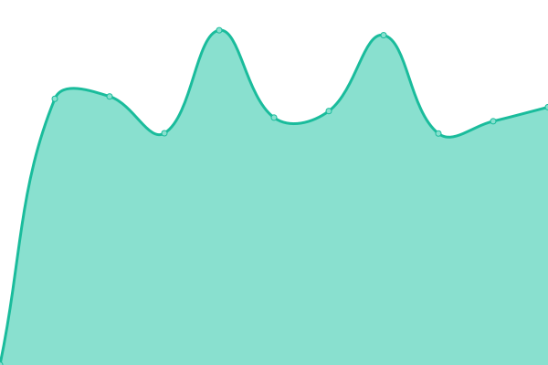

# [📈 Live Status](https://odqo.github.io/upptime): <!--live status--> **🟧 Partial outage**

This repository contains the open-source uptime monitor and status page for [odqo](https://www.odqo.ch), powered by [Upptime](https://github.com/upptime/upptime).

With [Upptime](https://upptime.js.org), you can get your own unlimited and free uptime monitor and status page, powered entirely by a GitHub repository. We use [Issues](https://github.com/odqo/upptime/issues) as incident reports, [Actions](https://github.com/odqo/upptime/actions) as uptime monitors, and [Pages](https://odqo.github.io/upptime) for the status page.

<!--start: status pages-->
<!-- This summary is generated by Upptime (https://github.com/upptime/upptime) -->
<!-- Do not edit this manually, your changes will be overwritten -->
<!-- prettier-ignore -->
| URL | Status | History | Response Time | Uptime |
| --- | ------ | ------- | ------------- | ------ |
|  [Google](https://www.google.com) | 🟩 Up | [google.yml](https://github.com/odqo/upptime/commits/HEAD/history/google.yml) | 

 61ms
     
 | 

<a href="https://odqo.github.io/upptime/history/google">100.00%</a>
    

|  [odqo](https://www.odqo.ch) | 🟩 Up | [odqo.yml](https://github.com/odqo/upptime/commits/HEAD/history/odqo.yml) | 

 189ms
     
 | 

<a href="https://odqo.github.io/upptime/history/odqo">100.00%</a>
    

|  [lafabriquecirculaire.ch](https://www.lafabriquecirculaire.ch) | 🟩 Up | [lafabriquecirculaire-ch.yml](https://github.com/odqo/upptime/commits/HEAD/history/lafabriquecirculaire-ch.yml) | 

 1354ms
     
 | 

<a href="https://odqo.github.io/upptime/history/lafabriquecirculaire-ch">100.00%</a>
    

|  [fromagerieamstutz.ch](https://www.fromagerieamstutz.ch) | 🟩 Up | [fromagerieamstutz-ch.yml](https://github.com/odqo/upptime/commits/HEAD/history/fromagerieamstutz-ch.yml) | 

 1205ms
     
 | 

<a href="https://odqo.github.io/upptime/history/fromagerieamstutz-ch">100.00%</a>
    

|  [acade-agro.ch](https://www.acade-agro.ch) | 🟩 Up | [acade-agro-ch.yml](https://github.com/odqo/upptime/commits/HEAD/history/acade-agro-ch.yml) | 

 898ms
     
 | 

<a href="https://odqo.github.io/upptime/history/acade-agro-ch">100.00%</a>
    

|  [art-werk.ch](https://www.art-werk.ch) | 🟩 Up | [art-werk-ch.yml](https://github.com/odqo/upptime/commits/HEAD/history/art-werk-ch.yml) | 

 983ms
     
 | 

<a href="https://odqo.github.io/upptime/history/art-werk-ch">100.00%</a>
    

|  [urbamonde.org](https://www.urbamonde.org) | 🟩 Up | [urbamonde-org.yml](https://github.com/odqo/upptime/commits/HEAD/history/urbamonde-org.yml) | 

 1417ms
     
 | 

<a href="https://odqo.github.io/upptime/history/urbamonde-org">100.00%</a>
    

|  [habitat-solidaire.ch](https://www.habitat-solidaire.ch/) | 🟥 Down | [habitat-solidaire-ch.yml](https://github.com/odqo/upptime/commits/HEAD/history/habitat-solidaire-ch.yml) | 

 988ms
     
 | 

<a href="https://odqo.github.io/upptime/history/habitat-solidaire-ch">16.95%</a>
    

|  [co-habitat.net](https://www.co-habitat.net) | 🟩 Up | [co-habitat-net.yml](https://github.com/odqo/upptime/commits/HEAD/history/co-habitat-net.yml) | 

 948ms
     
 | 

<a href="https://odqo.github.io/upptime/history/co-habitat-net">100.00%</a>
    

|  [CoHabitat.io](https://www.cohabitat.io) | 🟩 Up | [co-habitat-io.yml](https://github.com/odqo/upptime/commits/HEAD/history/co-habitat-io.yml) | 

 147ms
     
 | 

<a href="https://odqo.github.io/upptime/history/co-habitat-io">100.00%</a>
    

<!--end: status pages-->

[**Visit our status website →**](https://odqo.github.io/upptime)

## 📄 License

- Powered by: [Upptime](https://github.com/upptime/upptime)
- Code: [MIT](./LICENSE) © [odqo](https://www.odqo.ch)
- Data in the `./history` directory: [Open Database License](https://opendatacommons.org/licenses/odbl/1-0/)
